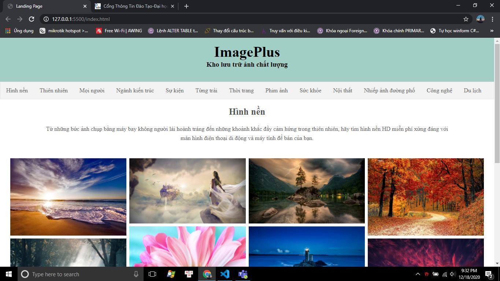

## Báo cáo thực hành
###### Môn: Thiết kế website
###### Nhóm: 90
###### Họ và tên sinh viên: Mã Văn Bảo
###### Mã sinh viên: 1721050317
###### Lớp chuyên ngành: DCCTKH62A
### Giải thích từng phần đã làm:
* Sử dụng mẫu Website thầy đã cho để phát triển bài làm với ý tưởng tạo một trang web cung cấp và hiển thị hình ảnh qua nhiều nội dung khác nhau.
* Sử dụng ngôn ngữ HTML tạo trang web, class, nhiều thẻ ngữ nghĩa và bố cục rõ ràng
* Viết CSS cho từng phần tử
* Sử dụng Script đơn giản
* Commit và push lên github thường xuyên trong suốt quá trình thực hiện
### Đường dẫn đến github
###### https://github.com/baocmls/static-web
### Hình ảnh giao diện:

